# CarDealershipDatabasePt2

This simple Java application allows you to interact with and edit
a MySQL Database based on a car dealership. 

### Home Screen

On the **Home** screen, you can choose one of the following:
- Display all vehicles
- Display by price range
- Display by make/model
- Display by year range
- Display by color
- Display by mileage
- Add a vehicle
- Delete a vehicle
- Admin Menu (Password is '**password**')
- Exit

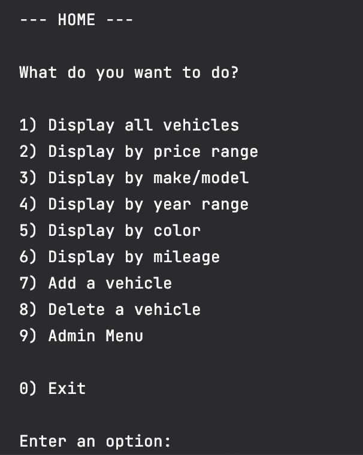

### Displaying All Vehicles

After selecting **Display all vehicles**, every single vehicle in the database
will be displayed along with all of their properties.

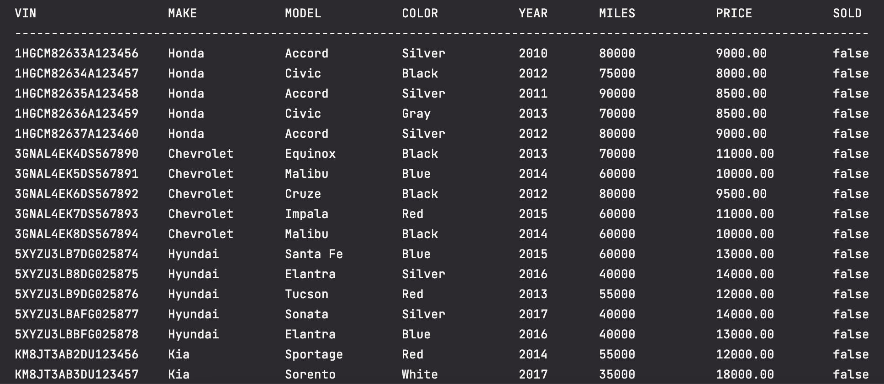

### Displaying By Price Range

After selecting **Display by price range**, you will be prompted for a minimum
and maximum price to filter by. After entering valid prices, all vehicles within
that price range will be displayed.

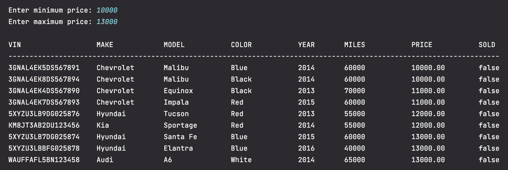

### Displaying By Make/Model

After selecting **Display by make/model**, you will be prompted for a make and model
to filter by. Once valid make and model is entered, every vehicle with that
make and model will be displayed.

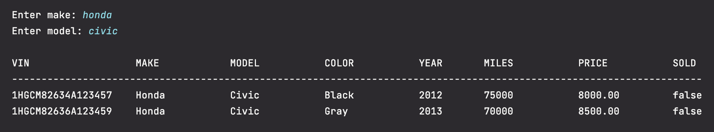

### Displaying By Year Range

After selecting **Display by year range**, you will be prompted for a minimum
and maximum year to filter by. After entering valid years, all vehicles within
that year range will be displayed.

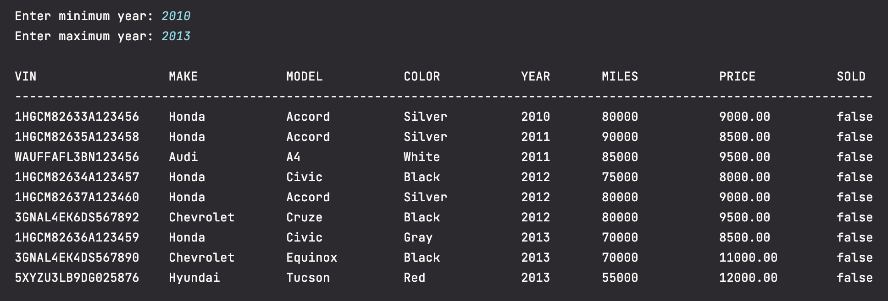

### Displaying By Color

After selecting **Display by color**, you will be prompted for a color
to filter by. Once valid color is entered, every vehicle matching that color
will be displayed.

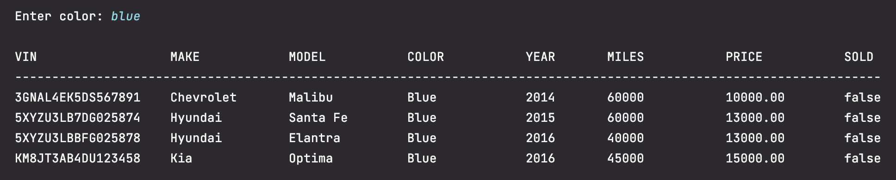

### Displaying By Mileage

After selecting **Display by mileage**, you will be prompted for a minimum and maximum
number of miles to filter by. Once valid mileage is entered, every vehicle
within that mile range will be displayed.

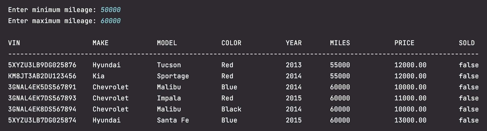

### Adding a Vehicle

After selecting **Add a vehicle**, you will be prompted for the following:
- VIN
- Make
- Model
- Color
- Year
- Mileage
- Price

After valid information is entered, a confirmation that the vehicle has been added
will be displayed.

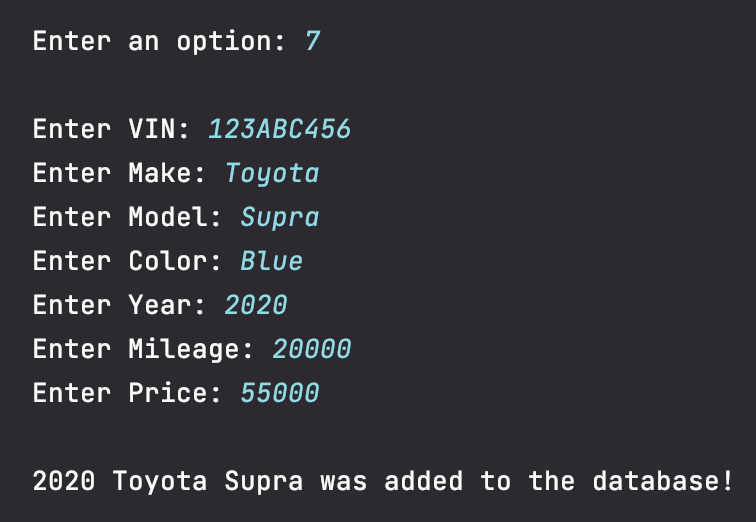

### Deleting a Vehicle

After selecting **Delete a vehicle**, all vehicles in the database will be displayed
and you will be prompted for a VIN to delete. After entering a valid VIN, you will be asked
to confirm that you want to delete the specified vehicle. Once confirmed, the vehicle will
be deleted from the database.

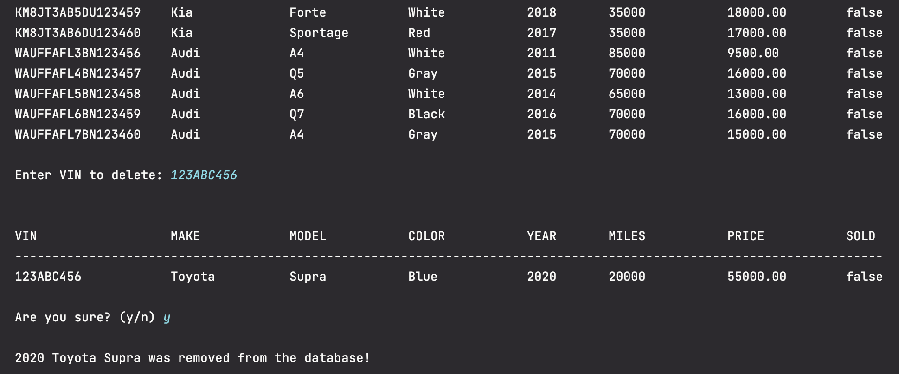

### Accessing the Admin Menu

After selecting **Admin Menu**, you will be prompted for the Admin password, which is
'**password**'. Once the Admin password is entered correctly, the Admin Menu will be displayed,
and you will have the following options:

- Display all sales contracts
- Display all lease contracts
- Back (Return to Home screen)

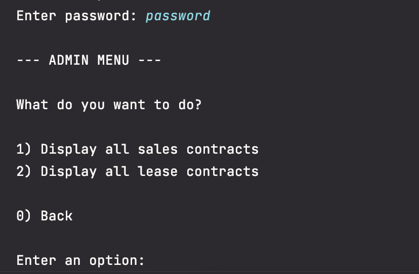

### Displaying All Sales Contracts

After selecting **Display all sales contracts**, every sales contract in the database
will be displayed along with their properties.

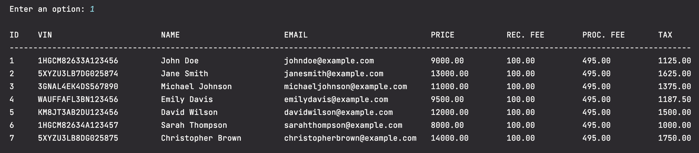

### Displaying All Lease Contracts

After selecting **Display all lease contracts**, every lease contract in the database
will be displayed along with their properties.

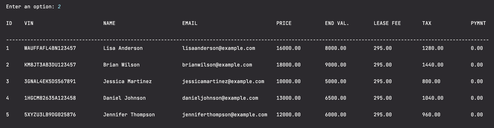